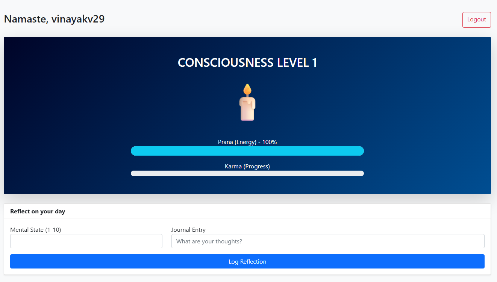
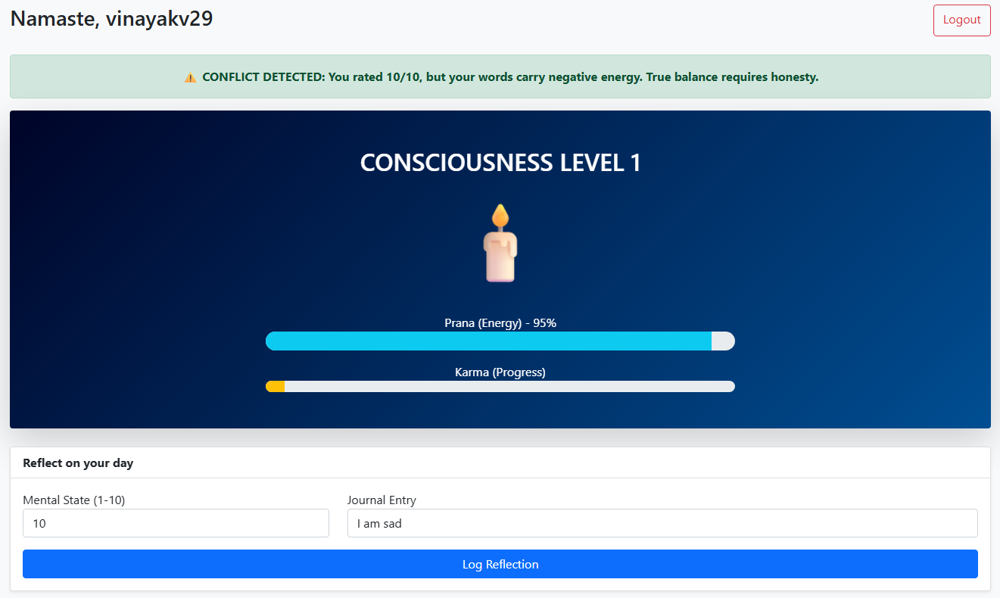

# Neelkantha - AI-Powered Mental Health Tracker

## 🧠 Project Overview
Neelkantha is a gamified behavioral health application designed to help students track their mental well-being. It addresses the issue of "emotional masking" by using **Artificial Intelligence** to detect discrepancies between a user's self-reported score and their written journal entries.

## 🚀 Features
* **Gamification:** Users evolve a spiritual avatar (Candle → Plant → Lotus → Sun) by maintaining consistent habits.
* **AI Conflict Detection:** Utilizes **TextBlob (NLP)** to analyze sentiment. If a user rates their day 10/10 but writes negative thoughts, the system flags an "Emotional Dissonance" warning.
* **Prana System:** Visualizes mental energy as a health bar that depletes with stress and regenerates with breathing exercises.

## 🛠️ Technologies Used
* **Backend:** Python (Flask)
* **Database:** SQLite & SQLAlchemy
* **AI/NLP:** TextBlob
* **Frontend:** Bootstrap 5, Jinja2

## ⚙️ Steps to Install & Run
1.  **Clone the repository** to your local machine.
2.  **Install dependencies**:
    ```bash
    pip install -r requirements.txt
    ```
3.  **Run the application**:
    ```bash
    python run.py
    ```
4.  **Open the app** in your browser at: `http://127.0.0.1:5000`

**Note:** The system will automatically generate the `database.db` file on the first run. No manual database setup is required.

## 🧪 Instructions for Testing
Follow these steps to verify the project features:

1.  **User Registration:**
    * Click "Start your journey" on the home page.
    * Register a new user (e.g., `testuser`).
2.  **Test AI Conflict Detection:**
    * Log in and go to the Dashboard.
    * Enter a **Score of 10** (Happy).
    * Enter the Note: **"I am feeling extremely sad and angry."**
    * Click **Log Reflection**.
    * **Expected Result:** A yellow warning "⚠️ CONFLICT DETECTED" should appear, and your Prana bar should drop.
3.  **Test Gamification:**
    * Log a few honest entries to gain XP.
    * Watch the XP bar fill up. Once it hits 50 XP, verify that the Avatar icon changes (e.g., from Candle 🕯️ to Plant 🌿).
4.  **Test Healing:**
    * If Prana is low, click the **"I have completed Pranayama"** button and verify that your health bar increases.

## 📸 Screenshots
### 1. Gamified Dashboard
The user's avatar evolves based on XP.


### 2. AI Conflict Warning
The system detects when a user is masking their true emotions.
